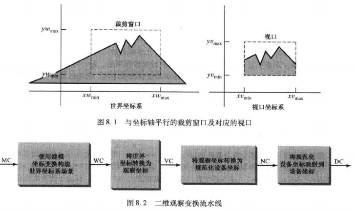
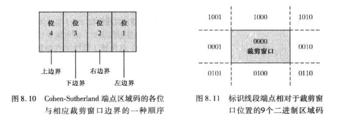

# 二维观察

二维观察变换(two-dimensional viewing transformation)

> 场景描述从二维世界坐标系到设备坐标系的映射
>
> ​		（有时也可称为窗口到视口的变换）



## 规范化和视口变换

保持视口与窗口中对象具有相同位置：
$$
\frac{xv-xv_{min}}{xv_{max}-xv_{min}}
=
\frac{xw-xw_{min}}{xw_{max}-xw_{min}}

\\\
\frac{yv-yv_{min}}{yv_{max}-yv_{min}}
=
\frac{yw-yw_{min}}{yw_{max}-yw_{min}}


\tag{8.1}
$$

## OpenGL函数

```c
glMatrixMode(GL_PROJECTION);//定义裁剪窗口和视口的函数将应用于投影矩阵
glLoadIdentity();//获得场景的另一观察
gluOrtho2D(xwmin,xwmax,ywmin,ywmax);//裁剪窗口函数（-1到1规范化坐标）
glViewport(xvmin,yvmin,vpWidth,vpHeight);//指定视口参数
```

## 裁剪算法

clipping algorithm:

​	消除指定区域内或区域外的图形部分的过程

### 点裁剪

$$
xw_{min} \le x \le xw_{max}\\\
yw_{min} \le y \le yw_{max} 
\tag{8.2}
$$

### 线段裁剪

$(x_0,y_0)$和$(x_{end},y_{end})$给出线段的两个端点
$$
x=x_0+u(x_{end}-x_0)\\\
y=y_0+u(y_{end}-y_0)\\\
0 \le u \le 1
\tag{8.3}
$$

#### Cohen-Sutherland线段裁剪算法

（计算交点之前进行了更多的测试）

线段端点：**区域码**(region code)的四位二进制码



预先判断端点在哪个区域码中

 PS : 两端点分别在 1001,0101，直接舍弃

#### 梁友栋-Barsky 线段裁剪算法

参数化线段裁剪

对端点为$(x_0,y_0)$和$(x_{end},y_{end})$的直线段，参数形式表示：
$$
x=x_0+u \Delta x\\\
y=y_0+u \Delta y\\\
0 \le u \le 1\\\
\Delta x=x_{end}-x_0,\Delta y=y_{end}-y_0
\tag{8.4}
$$
参数方程与点裁剪结合：
$$
xw_{min} \le x_0+u \Delta x \le xw_{max}\\\
yw_{min} \le y_0+u \Delta y \le yw_{max}
\tag{8.5}
$$
四个不等式表示为：
$$
up_k \le q_k , k=1,2,3,4
$$

$$
p_1=- \Delta x, q_1=x_0-xw_{min}\\\
p_2=\Delta x, q_2=xw_{max}-x_0\\\
p_3=-\Delta y,q_3=y_0-yw_{min}\\\
p_4=\Delta y, q_4=yw_{max}-y_0
\tag{8.6}
$$

当$p_k<0$时，线段从裁剪边界延长线的外部延伸到内部

当$p_k>0$时，线段从裁剪边界的内部延伸到外部

$p_k \ne 0$时，可计算出线段与边界k的延长线的交点u值：
$$
u= \frac{q_k}{p_k}
\tag{8.7}
$$

#### Nicholl-Lee-Nicholl线段裁剪算法

只适用于二维

